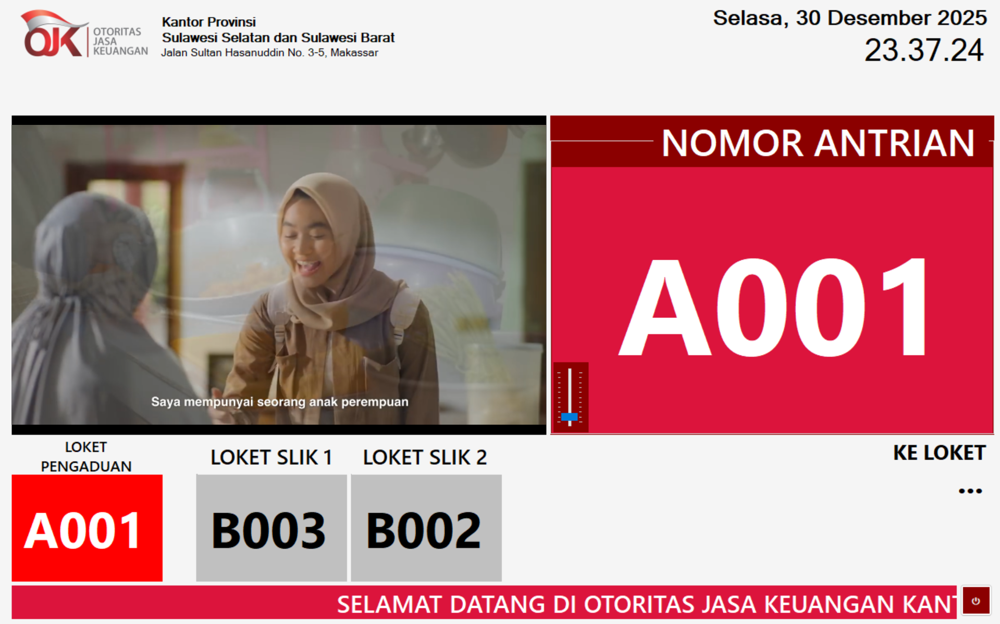
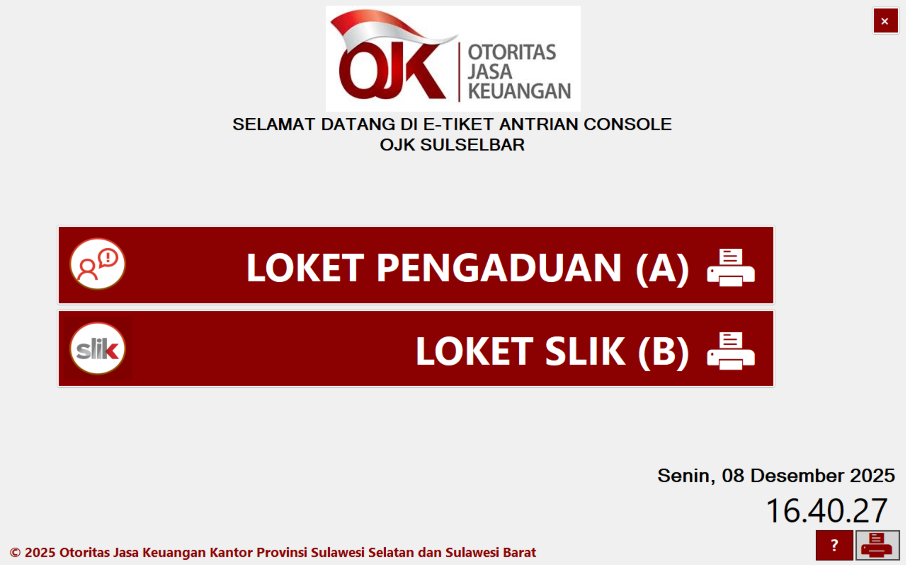
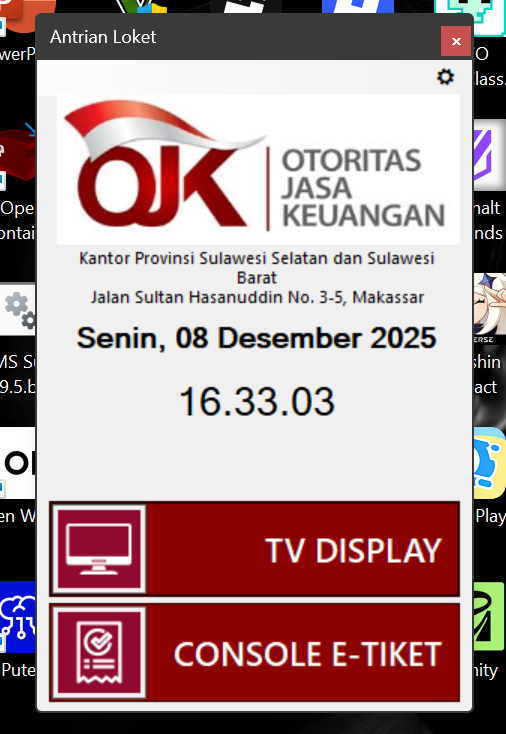

# 📊 Antrian E-Tiket & Display Pemanggil Antrian OJK

Aplikasi **Antrian E-Tiket dan Pemanggil Display Antrian OJK** adalah sistem antrian digital yang dirancang untuk meningkatkan efisiensi, keteraturan, dan transparansi layanan publik, khususnya di lingkungan **Otoritas Jasa Keuangan (OJK)**.

Aplikasi ini mendukung proses pengambilan nomor antrian secara elektronik, pemanggilan antrian terstruktur, serta tampilan display antrian real-time pada layar monitor/TV.

---

## ✨ Fitur Utama

- 🎟️ **E-Tiket Antrian**
  - Pengambilan nomor antrian secara digital
  - Nomor antrian tersimpan dan terkelola dengan rapi

- 🖥️ **Display Pemanggil Antrian**
  - Tampilan antrian real-time di layar TV/monitor
  - Informasi antrian jelas dan mudah dibaca

- 🔊 **Pemanggilan Antrian**
  - Pemanggilan antrian otomatis/manual oleh petugas
  - Mendukung integrasi audio (text-to-speech / suara panggilan)

- 🧭 **Manajemen Antrian**
  - Sistem First Come First Serve (FCFS)
  - Mengurangi penumpukan dan kesalahan pemanggilan

---

## 🛠️ Teknologi yang Digunakan

- **Bahasa Pemrograman**: C#
- **Platform**: Windows (Desktop Application)
- **Framework**: .NET (Windows Forms)
- **Database**: (opsional / menyesuaikan implementasi)
- **Display Output**: TV / Monitor eksternal

---

## 📷 Tampilan Aplikasi

### 🖥️ Display Antrian


### 🎟️ Pengambilan Tiket


### 🧑‍💼 Panel Admin


---

## 🚀 Cara Menjalankan Aplikasi

1. Clone repository ini
   ```bash
   git clone https://github.com/andi-arsal/antrian_loket_ojk.git

2. Buka project menggunakan Visual Studio
3. Restore dependency (jika ada)
4. Jalankan aplikasi ( Start / ```F5``` )
5. Hubungkan ke layar display untuk mode tampilan antrian

---

## 🎯 Tujuan Pengembangan

- Meningkatkan kualitas pelayanan publik
- Mengurangi antrian manual dan human error
- Mendukung transformasi digital layanan OJK
- Memberikan pengalaman layanan yang lebih tertib dan profesional

---

## 👨‍💻 Pengembang

**Andi Arsal Nur Al Amin N, S.Kom**
 
Staff IT & Pengamat Teknologi Informasi

Dikembangkan di bawah naungan: **PT. Ersal Integra Karya**

---

## 📄 Lisensi

Proyek ini dikembangkan untuk kebutuhan internal dan/atau kerja sama institusional.
Penggunaan dan distribusi lebih lanjut menyesuaikan kebijakan pengembang dan perusahaan.

---

## 💬 Catatan

Aplikasi ini masih dapat dikembangkan lebih lanjut, seperti:
 - Integrasi API eksternal
 - Mode online/offline
 - Dashboard statistik antrian
 - Versi web atau mobile

---
